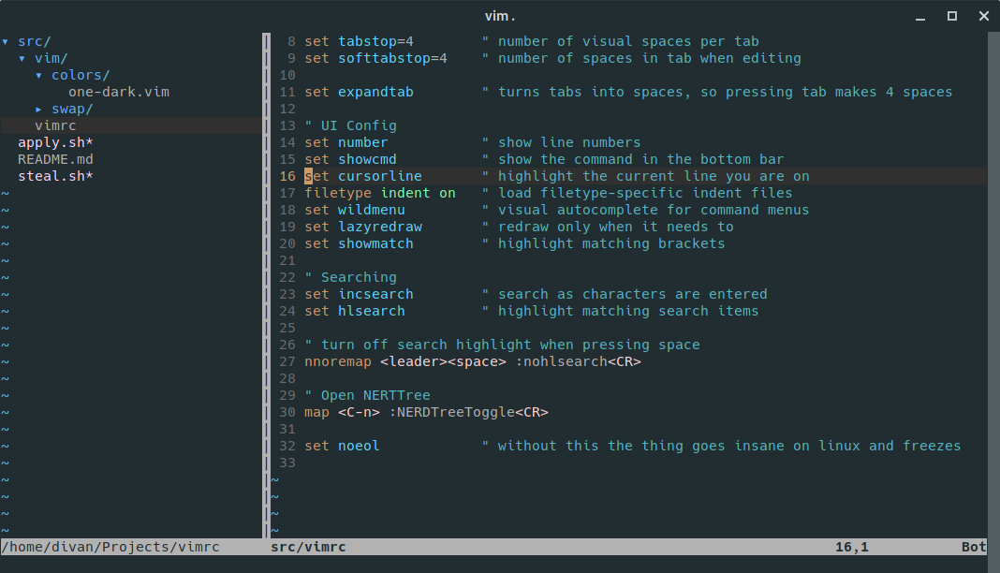

# Divan's personal vimrc

I started off with this article https://dougblack.io/words/a-good-vimrc.html

## Required Dependencies

`ctrl+n` nerdtree https://github.com/scrooloose/nerdtree
`ctrl+p`  ctrlp https://github.com/ctrlpvim/ctrlp.vim

## Shortcut cheatsheet

`ctrl-w ctrl-w` go to other split
`ctrl-w=` make splits equal
`vsplit file` split view vertically with file
`:hide` close window
`:only` close all but this

# Tmux

tmux new-session "tmux source-file ~/.vim/tmux-session"
